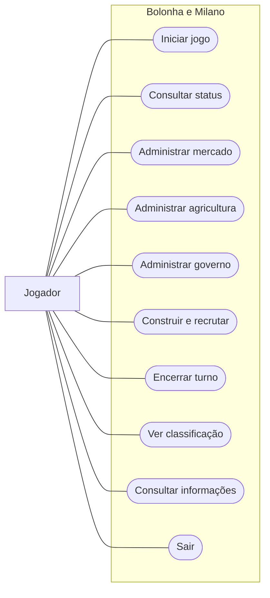

# Casos de uso

```mermaid
flowchart LR
 J[Jogador]
 subgraph Sistema[Bolonha e Milano]
 A([Iniciar jogo])
 B([Consultar status])
 C([Administrar mercado])
 D([Administrar agricultura])
 E([Administrar governo])
 F([Construir e recrutar])
 G([Encerrar turno])
 H([Ver classificação])
 I([Consultar informações])
 K([Sair])
 end
 J --- A & B & C & D & E & F & G & H & I & K
```