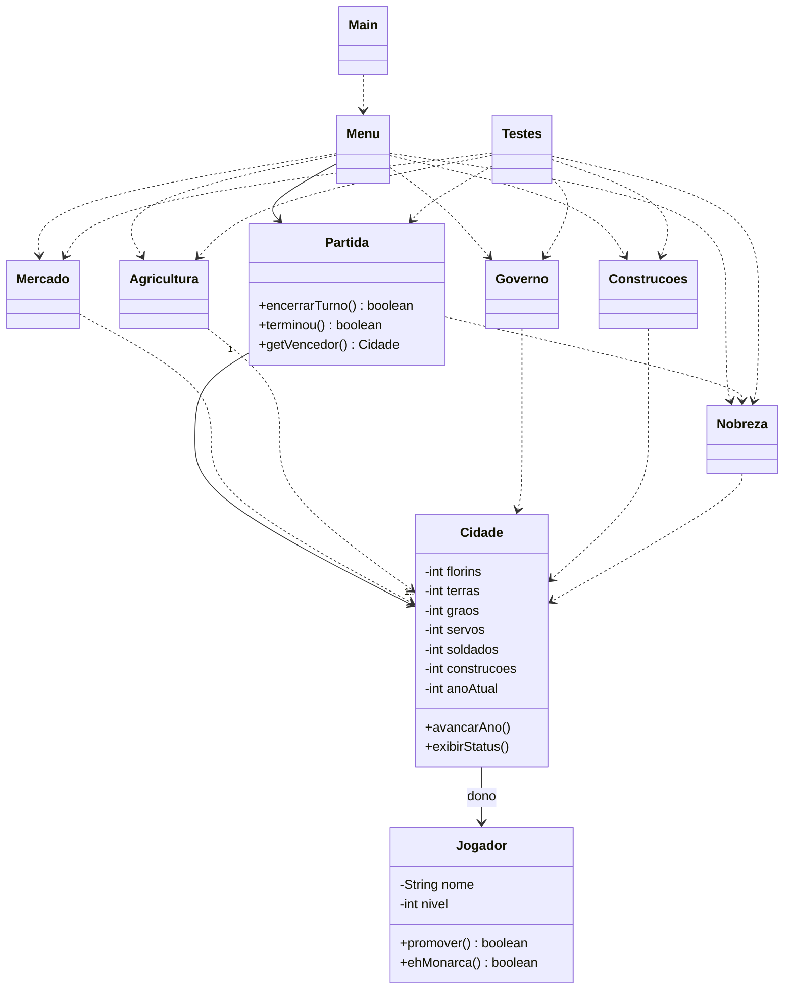

# Diagrama de classes

```mermaid
classDiagram
 Main ..> Menu
 Menu --> Partida
 Partida "1" --> "1..4" Cidade
 Cidade --> Jogador : dono
 Menu ..> Mercado
 Menu ..> Agricultura
 Menu ..> Governo
 Menu ..> Construcoes
 Menu ..> Nobreza
 Partida ..> Nobreza
 Mercado ..> Cidade
 Agricultura ..> Cidade
 Governo ..> Cidade
 Construcoes ..> Cidade
 Nobreza ..> Cidade
 Testes ..> Mercado
 Testes ..> Agricultura
 Testes ..> Governo
 Testes ..> Construcoes
 Testes ..> Nobreza
 Testes ..> Partida
 class Cidade {
 -int florins
 -int terras
 -int graos
 -int servos
 -int soldados
 -int construcoes
 -int anoAtual
 +avancarAno()
 +exibirStatus()
 }
 class Jogador {
 -String nome
 -int nivel
 +promover() boolean
 +ehMonarca() boolean
 }
 class Partida {
 +encerrarTurno() boolean
 +terminou() boolean
 +getVencedor() Cidade
 }
```