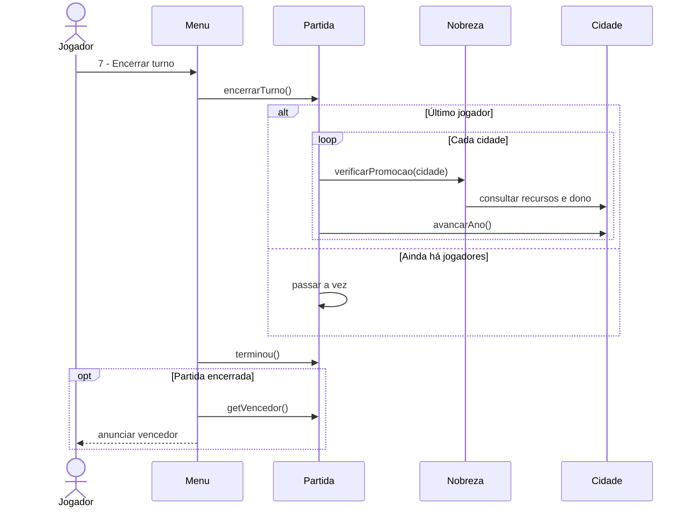

# Encerrar turno

```mermaid
sequenceDiagram
 actor Jogador
 participant Menu
 participant Partida
 participant Nobreza
 participant Cidade
 Jogador->>Menu: 7 - Encerrar turno
 Menu->>Partida: encerrarTurno()
 alt Último jogador
 loop Cada cidade
 Partida->>Nobreza: verificarPromocao(cidade)
 Nobreza->>Cidade: consultar recursos e dono
 Partida->>Cidade: avancarAno()
 end
 else Ainda há jogadores
 Partida->>Partida: passar a vez
 end
 Menu->>Partida: terminou()
 opt Partida encerrada
 Menu->>Partida: getVencedor()
 Menu-->>Jogador: anunciar vencedor
 end
```